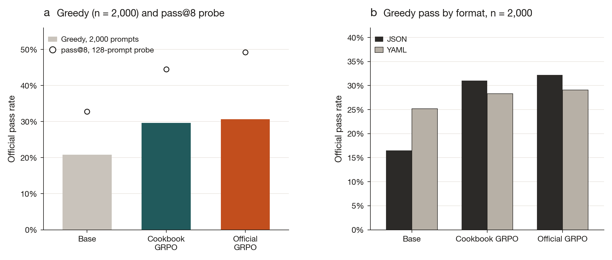
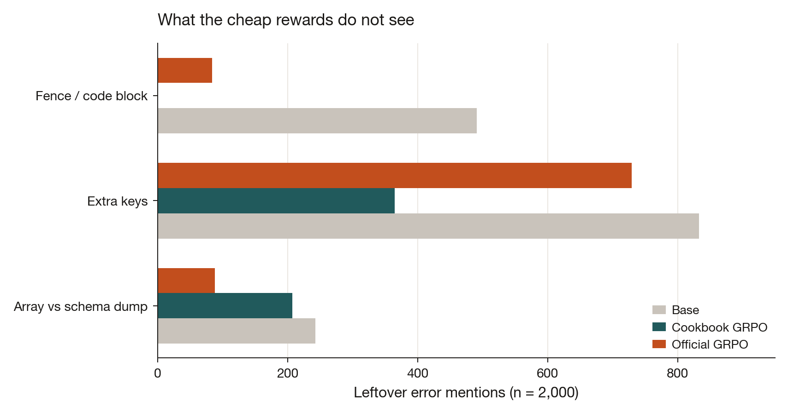
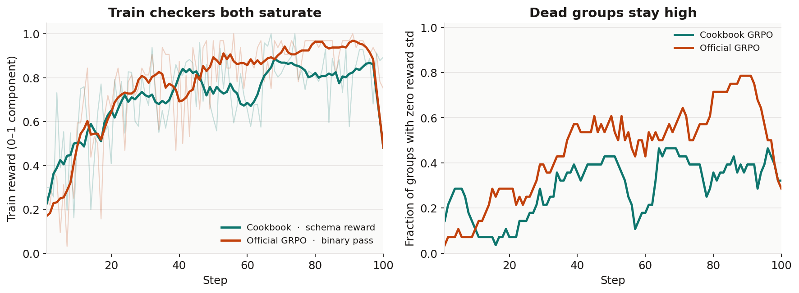

# structured-rlvr

Short reinforcement-learning-from-verifier-rewards (RLVR) recipes for **structured output**. The first experiment is [IFStruct](https://github.com/Liquid4All/ifstruct) instruction-following on [`LiquidAI/LFM2.5-350M`](https://huggingface.co/LiquidAI/LFM2.5-350M).

**Result.** A single-seed replication of Liquid’s public 100-step [GRPO cookbook](https://huggingface.co/blog/grpo-with-trl-ifstruct), scored with official IFStruct `validate_response` and Hugging Face `generate` (not llama.cpp). Base `LFM2.5-350M` went from **417/2000 (20.85%)** to **593/2000 (29.65%)**. Like the cookbook, most of the gain is JSON; YAML barely moved; leftover errors are missing fields, extra keys, counts, and shape. That is practical post-training, one seed, not a new RL method.

A second run used a held-out procedural generator and official-validator train rewards: **613/2000 (30.65%)**. Data and rewards both changed, so this is **not** a reward-only comparison.

## Results (LFM2.5-350M, 1 seed)

Every number below uses official `validate_response`. Greedy decode via HF `generate` (`do_sample=False`, `max_new_tokens=2048`).

### Official greedy, full 2,000 prompts

| Run | Official greedy | JSON | YAML |
|---|---:|---:|---:|
| Base `LFM2.5-350M` | 417/2000 (**20.85%**) | 16.5% | 25.2% |
| Cookbook GRPO (A0) | 593/2000 (**29.65%**) | 31.0% | 28.3% |
| Official-validator GRPO (A2) | 613/2000 (**30.65%**) | 32.2% | 29.1% |

A0 follows the cookbook envelope: Nemotron structured-output prompts, three train rewards, official exam at test. A2 keeps the same LoRA / GRPO setup (r=16, G=8, 100 optimizer steps, T=1.1, β=0.01) and swaps in official-shaped train rewards plus a held-out `train__*` prompt generator. YAML ~25% → 28–29%; almost all of the lift is JSON. Remaining failures are mostly missing required fields, extra keys, and list-vs-schema-dump shape — fences are mostly gone.

A0’s 29.65% is close to Liquid’s published 29.7%, but the decoder is different (HF `generate` vs llama.cpp), so this is not a rematch of the cookbook table. The cookbook already reports JSON-heavy gains and residual schema errors; this repo measures the same pattern under the official checker.

**Not claimed:** A2 beating A0 as a reward ablation (+20/2000 is one seed, data+reward confounded). A generator+cookbook “A1” control is **invalid as run** (wrapped prompts scored against the unwrapped array schema) and is not used here. Cookbook vs official rewards on identical JSON rows is future work.

On this config (`per_device_train_batch_size=4`, `gradient_accumulation_steps=8`, G=8, 100 steps, μ=1) GRPO generates **3,200 fresh completions**, not 4,000.

### Probe (128 even seeds `0..254`) — pass@8 and other trainers

The 128-prompt slice is 6.4% of the test set. It flattered A0 on greedy (35.2% vs 32.8%) relative to the full set (29.65% vs 30.65%). Use it for pass@8, not as the A0 vs A2 greedy ranking.

| Run | Official greedy | JSON | YAML | pass@8 (T=1.0) |
|---|---:|---:|---:|---:|
| Base `LFM2.5-350M` | 27/128 (**21.1%**) | 16.4% | 25.4% | 32.8% |
| Cookbook GRPO (A0) | 45/128 (**35.2%**) | 39.3% | 31.3% | 44.5% |
| Official-validator GRPO (A2) | 42/128 (**32.8%**) | 34.4% | 31.3% | **49.2%** |
| CoRPO (`R_min=2.0`) | 39/128 (**30.5%**) | 27.9% | 32.8% | — |
| RAFT (filter then SFT) | 20/128 (**15.6%**) | 26.2% | 6.0% | — |

CoRPO and RAFT are **not** matched-budget controls (RAFT stored 4,296 filter rollouts; GRPO here is 3,200). They are not a no-judge test of whether the compiler-as-judge is necessary. An easy→hard dataset sort was shuffled again by TRL (`shuffle_dataset=True`); that rerun does not establish that curriculum fails. An OPSA screen on the base greedy run skipped training: failures were not clearly lower-logp than passes.

Compact metrics: [`artifacts/ifstruct-lfm350/`](artifacts/ifstruct-lfm350/). Merged weights are not in git.



**Figure 1.** Official IFStruct pass, one seed. **a**, Greedy decode on the full 2,000-prompt split (bars) and pass@8 at T = 1 on the 128-prompt probe (circles). Cookbook GRPO and official-validator GRPO are highlighted. **b**, Full-set greedy pass split by output format.



**Figure 2.** Leftover official error mentions on the same 2,000 greedy generations (a completion can contribute more than one). Cookbook GRPO almost wipes fence failures. Extra keys and list-vs-schema-dump remain.



**Figure 3.** Training dynamics over 100 GRPO steps. **a**, Mean train-time reward (schema component for cookbook GRPO; official binary for official-validator GRPO). Thin traces are per-step means; thick traces are a 7-step moving average. **b**, Fraction of groups whose rewards have zero standard deviation.

### Examples (greedy, same seed)

Truncated. Snippets: [`artifacts/ifstruct-lfm350/examples_probe128.json`](artifacts/ifstruct-lfm350/examples_probe128.json).

1. **JSON array vs schema dump (seed 18).** Prompt wants a JSON array of customer-email threads. Base and A2 emit `{"type": "array", "items": [...]}` (a JSON Schema wrapper) and fail with `expected array, got dict`. A0 emits a bare JSON array and passes.
2. **YAML bare list (seed 0).** Prompt asks for a bare array of chapters, not wrapped under `chapters:`. Base and A0 wrap under `chapters:`. A2 emits a bare list, then fails an enum (`tone: reflective` is not allowed).
3. **YAML item count (seed 36).** Prompt asks for 2–3 repro-step batches. Base emits one item. A0 and A2 both pass.

## Setup

```bash
python -m venv .venv && source .venv/bin/activate
pip install -e ".[train]"   # train extra pins trl==1.7.1 and peft
cp .env.example .env        # set HF_TOKEN; never commit .env
```

CPU tests:

```bash
pip install -e ".[dev]"
pytest -q
```

GPU (CUDA PyTorch already installed):

```bash
bash scripts/setup_gpu.sh
bash scripts/run_baseline.sh   # 128-probe greedy + OPSA screen
bash scripts/run_a0.sh         # cookbook GRPO
bash scripts/run_a2.sh         # official-validator GRPO
```

`HF_TOKEN` is only needed to download models and datasets.

## Layout

```
src/ifstruct_rl/     eval, generator, rewards, trainers
scripts/             one-command runs
artifacts/<exp>/     compact metrics (no generations, no weights)
tests/
```

## License

Apache-2.0. IFStruct and the Liquid cookbook remain their authors’ work; this repository reproduces and measures them.
